# Adivina el número || Guess the number
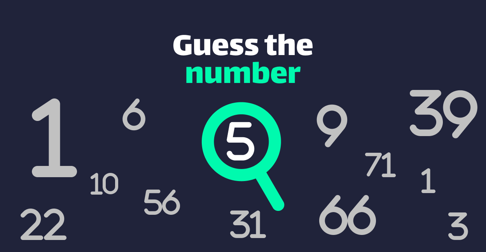
## Concepto

**Adivina el número** o **Guess the number** es una aplicación android que implementa al famoso juego de adivinar un número oculto. Las normas del juego son muy sencillas. La máquina generará un número entero aleatorio entre 0 y 100 y el jugador tendrá 5 intentos para adivinar qué número es el que se ha generado. A modo de ayuda, por cada intento fallido el juego dará pistas al jugador, indicandole si el número que ha introducido es menor o mayor qué el número oculto. Con cada pista el jugador

## Navegación

El sistema de navegación entre pantallas de la aplicación es muy sencillo, en la siguiente imagen se puede ver de forma visual la interconexión entre las pantallas de la aplicación:  

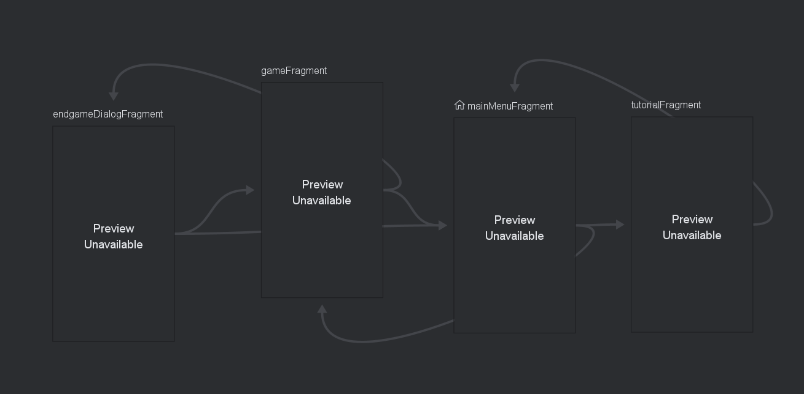

### Inicio
La página principal o portada recibe el nombre de `mainMenuFragment` viene a ser la raiz de acceso a las diferentes pantallas existentes. 
Desde esta pantalla principal tenemos acceso a otras 2 pantallas:
1. Tutorial: `tutorialFragment`
2. Gameplay: `gameFragment`
  
Esta página contiene el logotipo de la aplicación, el cual cambia dependiendo del idioma. También incluye 3 botones de acción.
1. Jugar: Es el botón que nos lleva a la pantalla de `gameFragment`.
2. Tutorial: El botón que abre el fragmento de `tutorialFragment`.
3. Salir: Es el botón que cierra la aplicación.

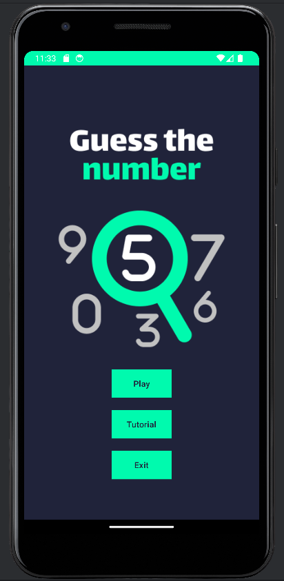
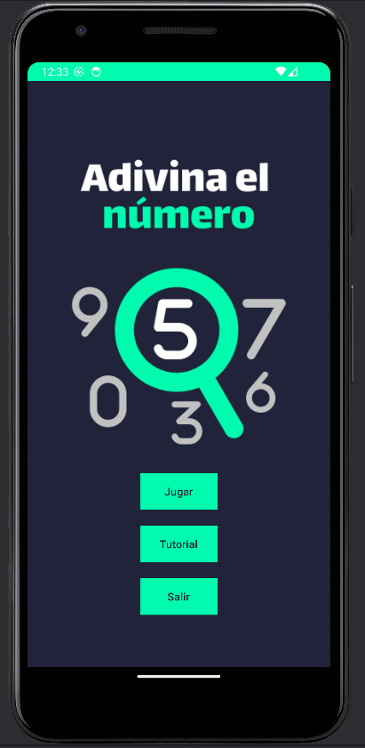

### Tutorial
La página del tutorial recibe el nombre de `tutorialFragment` dentro del esquema anterior. Este fragmento contiene un tutorial de ayuda al jugador sobre cómo jugar. Este componente contiene un botón que redirige al usuario al fragmento de `mainMenuFragment`.

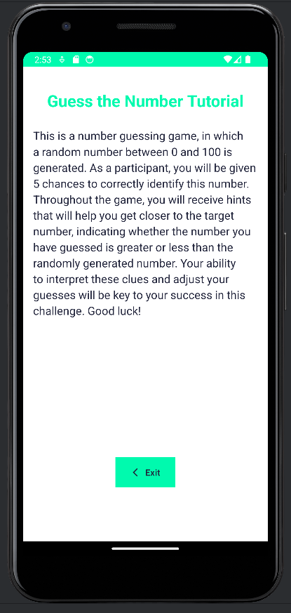
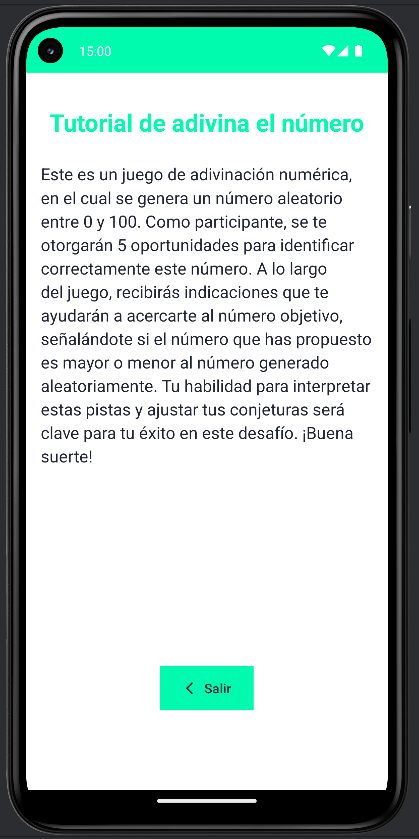
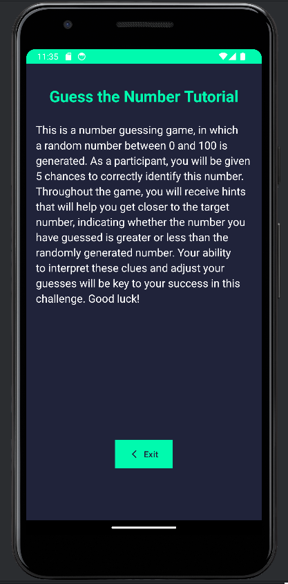

### Gameplay
Este es el fragmento que contiene la lógica del juego en si. Contiene la interfaz visual con los datos de la partida (vidas restantes, feedback con las pistas...)  

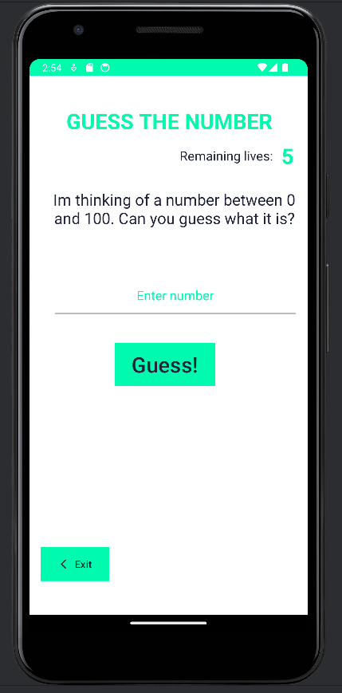 
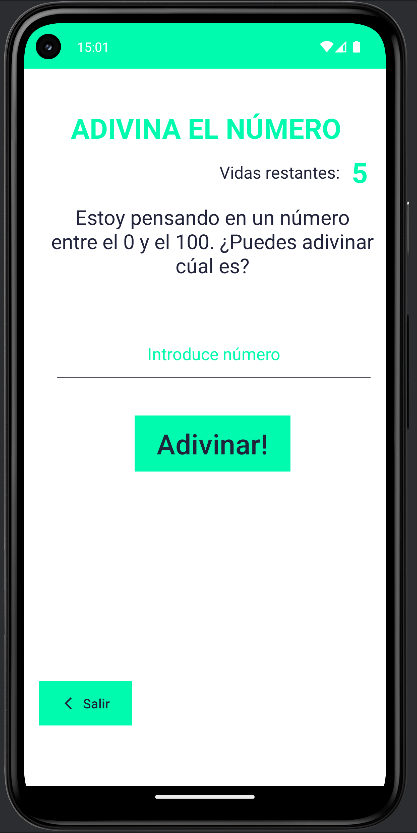 
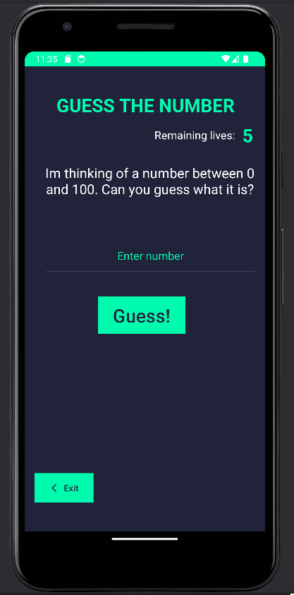 
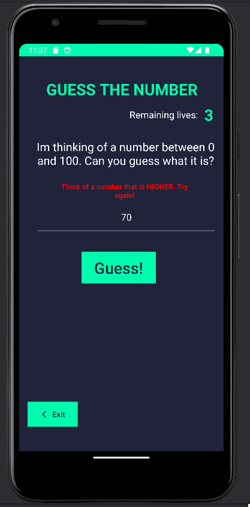

Este componente se conecta con 2 fragmentos:
1. Pantalla Inicio: `mainMenuFragment` se conecta a través de un **botón** que se encuentra disponible durante toda la ejecución del fragmento. Permite al usuario salir de la pantalla aunque no se haya terminado el juego.
2. Resultado de partida: `endgameDialogFragment`, este fragmento se activa ante 2 situaciones:
    1. **El jugador pierde la partida**: Se produce cuando el jugador se queda sin vidas y no ha acertado el número secreto.
    2. **El jugador gana la partida**: Se produce cuando el jugador acierta el número secreto.

El fragmento de `gameFragment` (El fragmento que contiene la lógica del juego) enviará al dialog fragment `endgameDialogFragment` los siguientes argumentos:
1. **numeroGanador**: `Integer` que contiene el número secreto que ha generado la aplicación para la partida actual.
2. **victoria**: `Boolean` que indica si el jugador ha ganado o perdido la partida. 
    - **True**: el jugador ha acertado el número.
    - **False**: el jugadorno ha logrado acertar el número. 

### Dialogo fin de partida.
Es el dialogo que se muestra en pantalla cada vez que termina una partida. Tal como se indicó con anterioridad, recibe 2 argumentos por parte del fragmento `gameFragment`, los cuales son **numeroGanador** y **victoria**, gracias a estos 2 argumentos se puede mostrar al jugador la información correspondiente con el fin de la partida:
- Cual era el número secreto. Eso se consigue escribiendo el valor de `numeroGanador` en un **textView** del fragmento.
- Cual ha sido el resultado de la partida. Gracias al valor booleano de **victoria** se puede hacer que el fragmento sea dinamico, pudiendo ser aplicado tanto para victorias como para derrotas atendiendo al valor del argumento recibido.

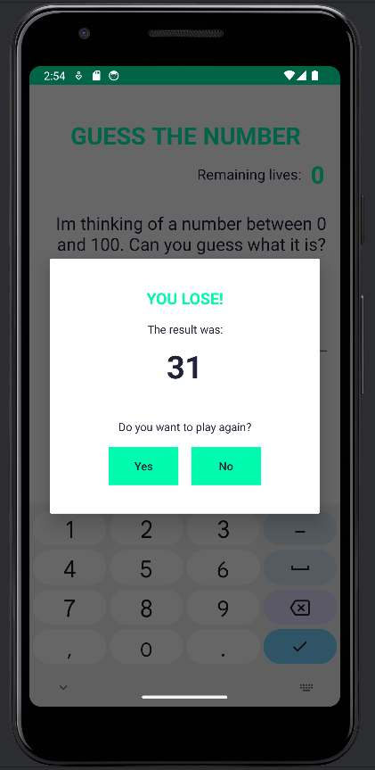
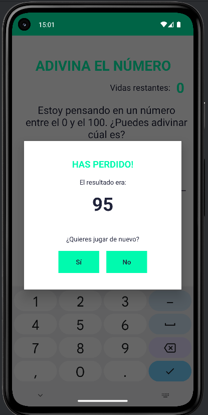
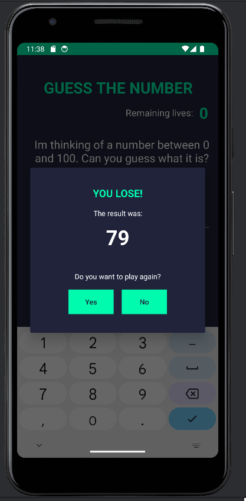 
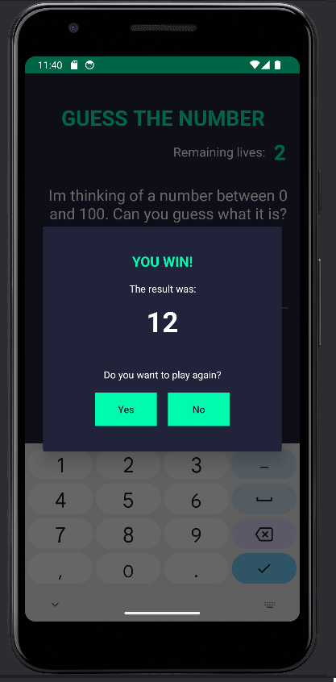

Por otro lado el dialogo cuenta con 2 botones que se corresponden a si el jugador quiere volver a jugar otra partida:
1. **Si**: Se carga nuevamente el fragmento de `gameFragment` con los datos reseteados para que se pueda llevar a cabo una nueva partida.
2. **No**: Se carga el fragmento de `mainMenuFragment` es decir el fragmento de inicio, dándole al jugador la posibilidad de salir de la aplicación, leer el tutorial o volver a jugar otra partida.

